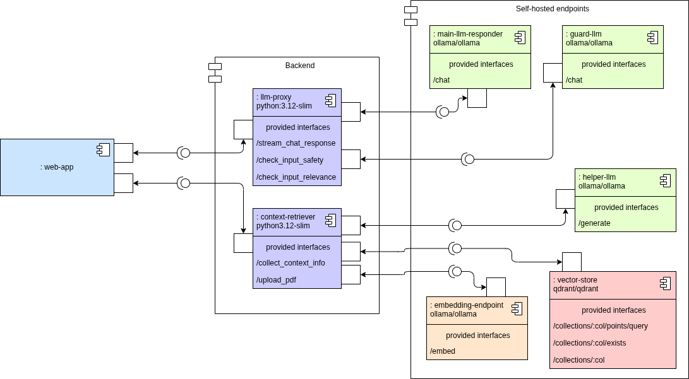
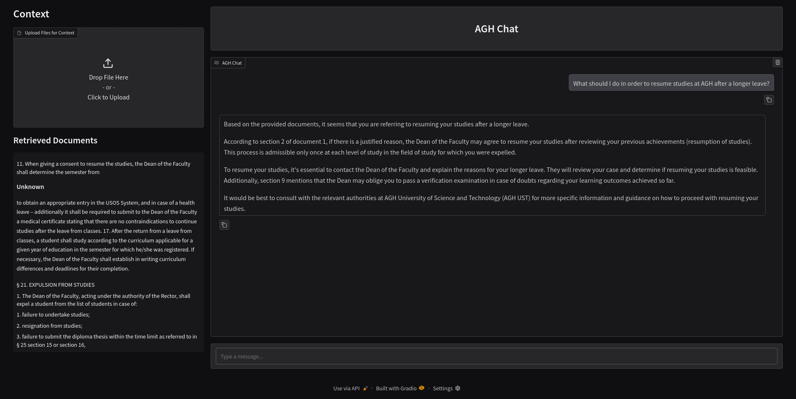
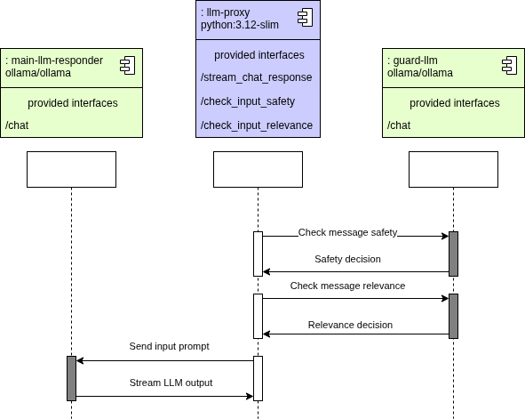
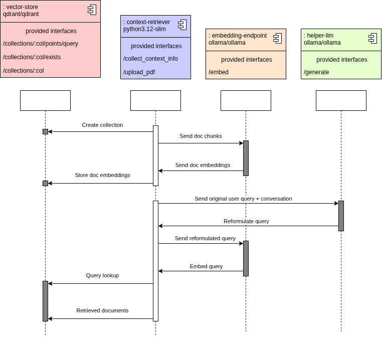

# rag-app

This project contains a web application enabling the user to chat with an LLM-based chatbot with access to additional context information, leveraging the RAG paradigm. The chat bot is designed to represent AGH University of Krakow and the entire infrastructure is developed to support self-hosted LLMs for text generation, embeddings or safety checks. The app is a minimal-setup, demonstration application that could be deployed as a tuned assistant chat bot to answer questions regarding the institution, based on internal source of truth.

## System overview

The system is a three-level hierarchy:

- **Web application** - the only endpoint available to the user.
- **Backend** - isolated environments where the requests are validated and processed
- **Self-hosted endpoints** - LLM and Vector Store endpoints leveraging the internal infrastructure of the institution, e.g. data centers and computation clusters 

### Web application

The implementation of the application is demonstration-purpose. It facilitates two primary interactions: 1. Sending messages to the chat bot, 2. Adding documents to the knowledge base (in production setup, this functionality should require admin privileges).

The communication with the chatbot follows this lifecycle:
1. The user asks a question.
2. The question is validated with respect to its safety
3. The question is validated with respect to its relevance to the specified list of topics (e.g. preventing the user from asking questions about politics)
4. For the given user message, a set of document chunks is collected from the knowledge store, based on their relevance to the question
5. The message is sent to the main LLM, which responds to the question, based on the conversation history and documents

### Backend

#### llm-proxy

It is responsible for administering the conversation with the chatbot. It is a layer of communication between the web app and the assistant that provides additional validation services.

1. Safety check - using a specialized smaller LLM, it checks whether the user query contains harmful/illegal content, responding to which would compromise the institution.
2. Relevance check - it examines the query and checks if it follows one of the specified topics, e.g. the question is about the rules of admission to the university, rather than cooking a perfect pasta.
3. Chat response generation - based on the conversation context and provided documents, it composes a prompt and streams the response of the main LLM.

#### context-retriever

It is responsible for handling IO operations on the internal knowledge base. In particular, it does:

1. Document uploading - it scopes the file validation, loading, chunking and storing the embedded chunks in a vector store
2. Information Retrieval - the user query is embedded and compared with the stored chunk embedding in order to retrieve the most relevant chunks.
3. Query Reformulation - before embedding the query, it must be reformulated using the helper LLM so that it reflects the context of the conversation, e.g.
   - **User:** Hello, my name is Wiktor and I've just graduated from a secondary school in Berlin. **Assistant:** Hello, Wiktor. How can I help you? **User:** How can I apply for the university?
   - **Reformulated query:** What are the admission rules for first-degree studies for non-polish students?

### Self-hosted endpoints

- **main-llm-responder** - the primary LLM responsible for the generation of responses to the user's messages
- **guard-llm** - specialized at detecting harmful behavior and questions diverging from the expected topics
- **helper-llm** - used during the document retrieval for e.g. query reformulation
- **embedding-endpoint** - embeds the documents to store them in a Vector DB
- **vector-store** - stores the embedded documents together with their metadata and handles distance-based query lookups

## Development

It is advisable to use the VSCode's Development Container mechanism for development. The default configuration allows to set up a Docker container with all dependencies and functionalities, such as Docker-in-Docker.

### Setup

The most important elements of the project structure are:

- `services/` - contains implementations of endpoints being the highest-level modules of the entire system
- `docker-compose.yml` - contains configurations for setting up the endpoints, together with the description of the endpoint-endpoint communication
- `.devcontainer` - contains configuration of the Devcontainers, within which the services are supposed to be developed. It is recommended to use `docker compose` in the `base` devcontainer and develop each service in isolation using its specialized devcontainer

## Changelog

Refer to `Changelog.md`.
