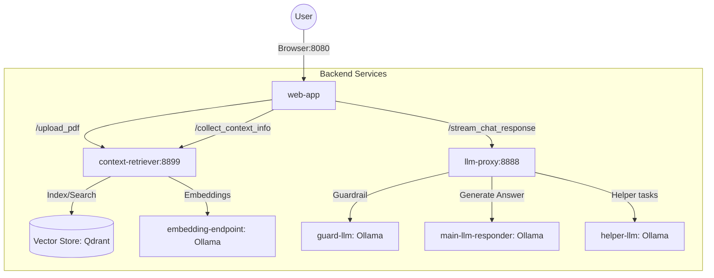

# System Architecture & Service Documentation

## 1. High-Level Architecture Diagram

This diagram illustrates how data flows from the user interface down to the AI models.

---

## 2. Service Definitions

### `web-app` (Port 8080)

The primary user interface built with **Gradio**.

* **Role:** Handles the Graphical User Interface (GUI), manages PDF uploads, and displays the chat conversation.
* **Interactions:** * Communicates with `context-retriever` to fetch relevant document snippets.
* Communicates with `llm-proxy` to receive streamed AI responses.

### `context-retriever` (Port 8899)

The core of the **RAG** (Retrieval-Augmented Generation) mechanism.

* **Role:** Manages external knowledge and document processing.
* **Key Endpoints:**
* `POST /upload_pdf`: Processes PDF files, splits them into chunks, and stores them in the vector database.
* `POST /collect_context_info`: Retrieves the most relevant text fragments based on the user's query and chat history.

* **Dependencies:** Relies on **Qdrant** (Vector Store) and the **nomic-embed-text** model for generating vector embeddings.

### `llm-proxy` (Port 8888)

An intelligent orchestrator for Large Language Models.

* **Role:** Manages the logic of response generation, including context integration and safety checks.
* **Key Endpoints:**
* `POST /stream_chat_response`: Accepts the user query and retrieved context, coordinating with various Ollama instances to produce a final answer.

* **Dependencies:** Interfaces with `main-llm-responder` and `guard-llm`.

### AI Model Services (Ollama-based)

* **`main-llm-responder` (Port 11434):** The primary engine (Llama 3.1) responsible for generating the final user response.
* **`guard-llm` (Port 11435):** A safety-focused model (Dolphin) used to validate or filter inputs/outputs.
* **`embedding-endpoint` (Port 11436):** Specifically used to convert text into mathematical vectors for the database.

---

## 3. Communication Flow (The "Request Journey")

1. **User Input:** The user types a question into the `web-app`.
2. **Context Retrieval:** The `web-app` asks the `context-retriever`: *"Do we have any documents related to this question?"*.
3. **Vector Search:** `context-retriever` searches the **Qdrant** database and returns the most relevant text snippets.
4. **Proxy Coordination:** The `web-app` bundles the User's question + the Context snippets and sends them to the `llm-proxy`.
5. **LLM Generation:** `llm-proxy` instructs the **Main LLM** to answer the question *only* using the provided facts.
6. **Streaming:** The generated answer is streamed back through the Proxy to the `web-app` for a real-time typing effect.

---

### 4. Technology Stack

| Category | Technology | Usage |
| --- | --- | --- |
| **Language** | **Python 3.12** | Core language for all microservices. |
| **Web Framework** | **FastAPI** | High-performance framework for backend APIs. |
| **Frontend UI** | **Gradio** | Interface for chat and file uploads. |
| **LLM Engine** | **Ollama** | Local hosting and serving of LLMs (Llama 3.1, Dolphin). |
| **Vector Database** | **Qdrant** | High-performance vector database for RAG context storage. |
| **Package Manager** | **uv** | Extremely fast Python package installer and resolver. |
| **Configuration** | **Hydra / OmegaConf** | Hierarchical configuration management. |
| **Deployment** | **Docker / Docker Compose** | Containerization and multi-service orchestration. |
| **Workflow** | **Just** | Command runner for simplified development tasks. |

### 5. Key Architecture Features

Warto dodać te punkty, aby pokazać, że projekt jest "przemyślany":

* **Asynchronous Communication:** Services communicate using `httpx` and `FastAPI`'s async capabilities to handle streaming without blocking.
* **Scalability:** Each component (LLM, Vector Store, Proxy) is a separate container, allowing them to be scaled or replaced independently.
* **Local-First / Private:** No data leaves the local environment. All embeddings and inference happen on-premise via Ollama.
* **Healthcheck-Driven Orchestration:** The system ensures all heavy AI models are loaded before starting the retrieval logic.

---

### 6. Suggested Improvements (Roadmap)

Dodanie tej sekcji pokaże Twojemu prowadzącemu/koledze, że widzisz pole do rozwoju:

* **Support for more formats:** Adding `.docx` or `.html` support in `context-retriever`.
* **Evaluation module:** Implementing a framework to test the quality of RAG answers.
* **Frontend Enhancements:** Transitioning from Gradio to a custom React/Next.js frontend for more UI flexibility.

---